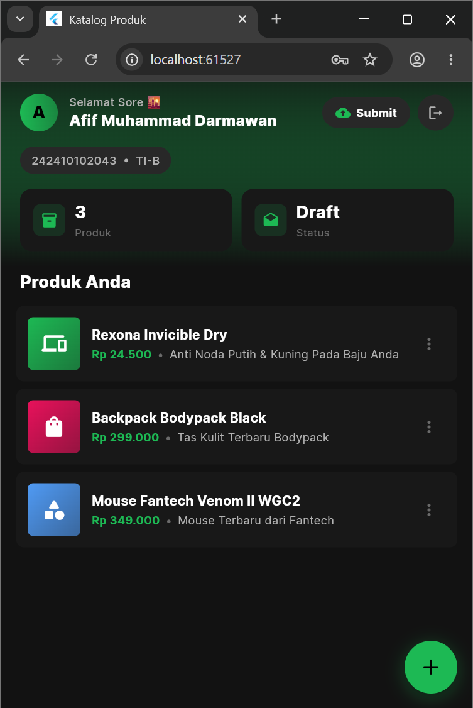
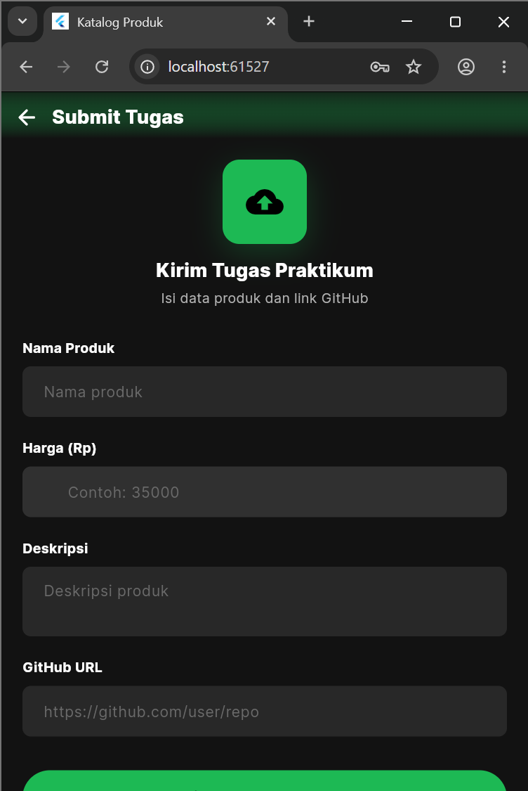

# pbm_tugas_praktikum

# Tugas Praktikum PBM

Aplikasi manajemen katalog produk dengan fitur manajemen draf, autentikasi, dan pengumpulan tugas yang terintegrasi.

## 📸 Screenshot Aplikasi

Berikut adalah dokumentasi antarmuka (UI) dari aplikasi Saya:

### 1. Autentikasi & Beranda
| Login Screen | Home Screen |
| :---: | :---: |
|  |  |

### 2. Manajemen Produk
| Daftar Produk | Tambah Produk | Hapus Produk |
| :---: | :---: | :---: |
|  |  |  |

### 3. Notifikasi & Sesi
| Produk Disimpan | Logout | Tugas Screen |
| :---: | :---: | :---: |
|  |  |  |

---

## Fitur Utama
* **Autentikasi User:** Pengamanan akses masuk ke dalam aplikasi.
* **Katalog Produk:** Menampilkan daftar produk yang tersedia.
* **Manajemen Draft:** Fitur untuk menambah dan menghapus data produk.
* **Pop-up Feedback:** Memberikan notifikasi visual saat aksi berhasil dilakukan.
