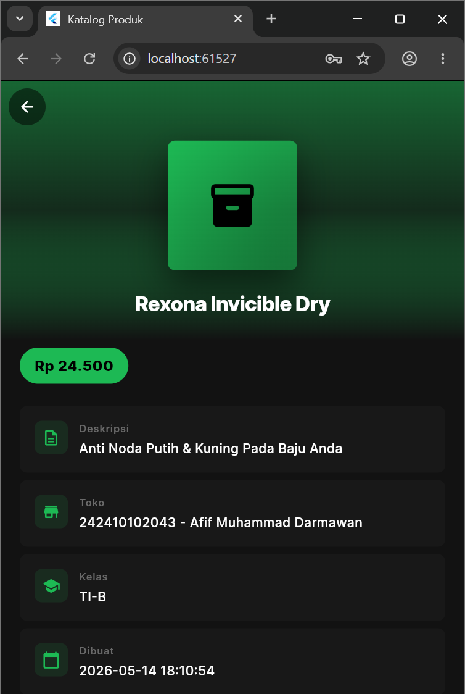
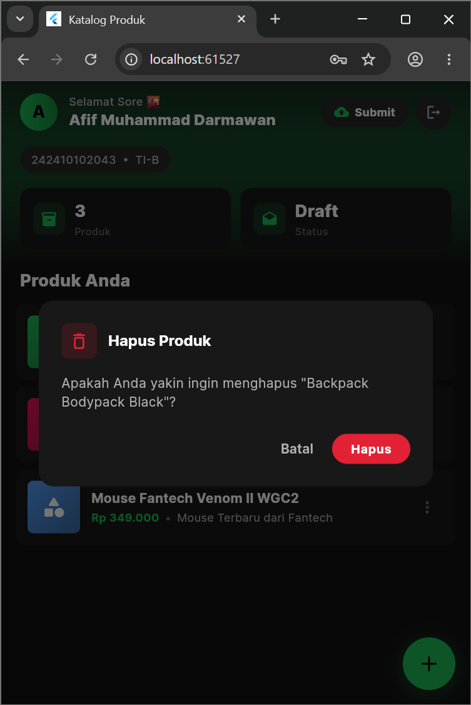
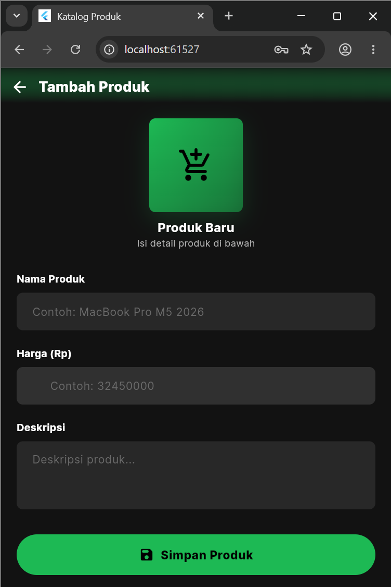
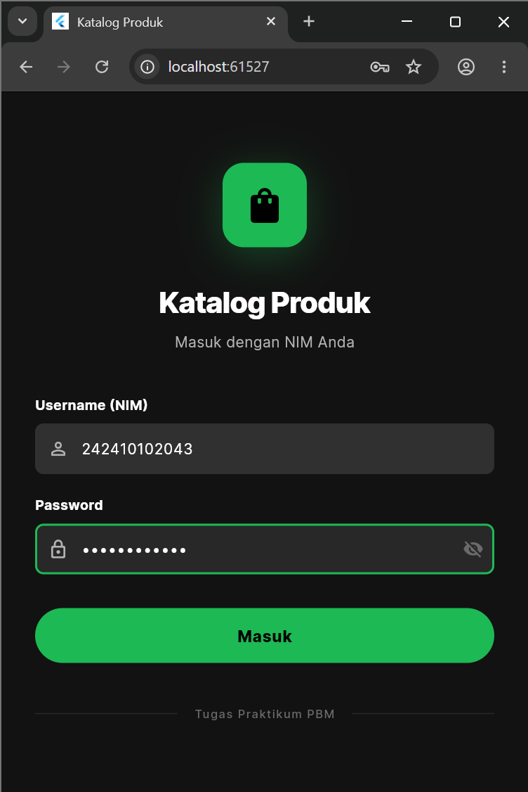
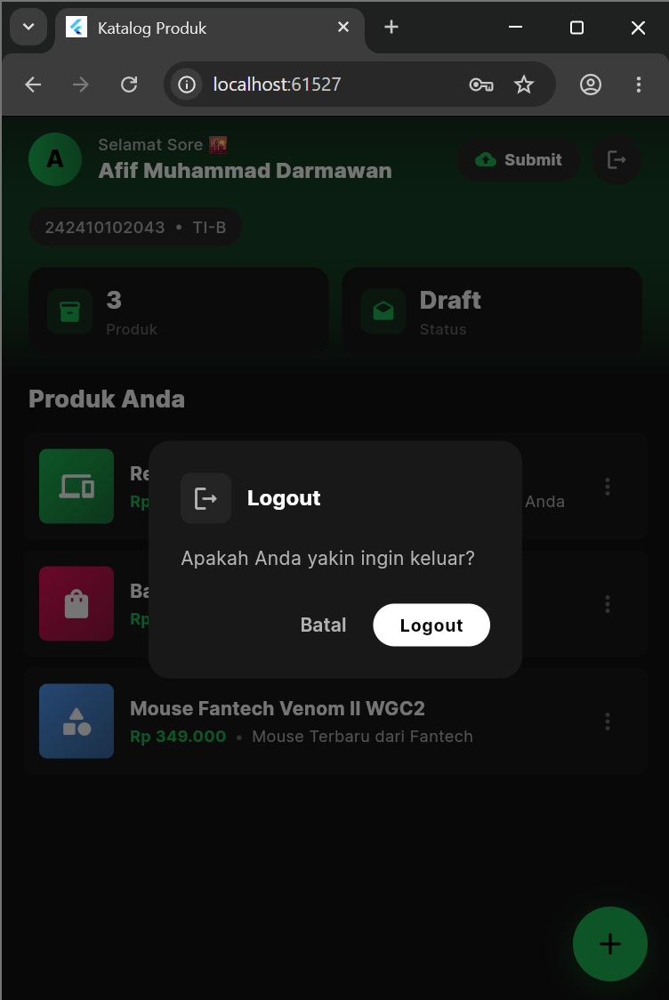
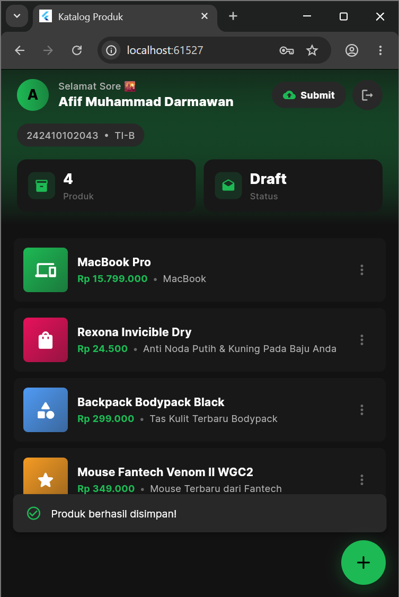

# PBM Tugas Praktikum

Proyek ini adalah aplikasi Flutter yang sedang dikembangkan untuk memenuhi tugas praktikum Pemrograman Berbasis Mobile.

## Preview Aplikasi

Berikut adalah cuplikan layar dari antarmuka aplikasi:

| Deskripsi | Gambar |
| --- | --- |
| **Dashboard Utama** |  |
| **Halaman Produk** |  |
| **Hapus Produk** |  |
| **Tambah Produk** |  |
| **Login** |  |
| **Logout** |  |
| **PopUp Berhasil** |  |

## Struktur File Gambar

Berdasarkan direktori proyek, file gambar berikut digunakan untuk dokumentasi:
* `Hapus_Product_Screen.png`
* `Home_Screen.png`
* `Login_Screen.png`
* `Logout_Screen.png`
* `PopUp_Product_Disimpan.png`
* `Product_Screen.png`
* `Tambah_Product_Screen.png`
* `Tugas_Screen.png`
* `Cuplikan layar 2026-05-14 183219.jpg`

---
*Dibuat untuk keperluan dokumentasi tugas praktikum.*